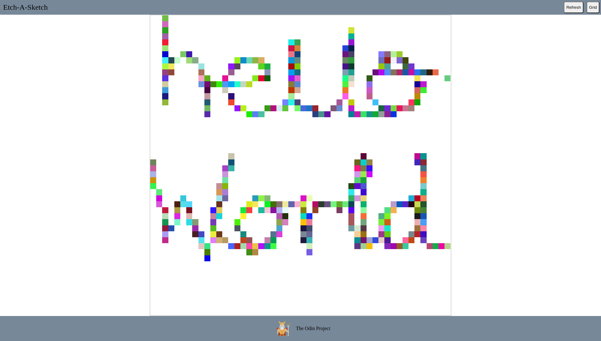

# odin-etch-a-sketch
Toy etch-a-sketch project using vanilla `JavaScript`, `HTML`, and `CSS`. Live demo [hero](#). 

.
// https://nicoguaro.github.io/posts/cyclic_colormaps/
// https://krazydad.com/tutorials/makecolors.php